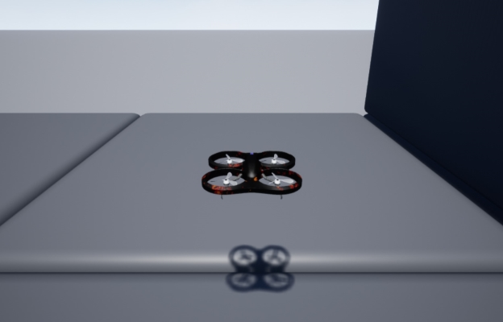

# Welcome to Project AirSim

Project AirSim is a simulation platform for drones, robots, and other autonomous systems.

Building on the previous work of **[AirSim](https://github.com/microsoft/AirSim)**, it leverages **[Unreal Engine 4](https://www.unrealengine.com/)** to provide photo-realistic visuals, while providing the simulation framework needed to integrate custom physics, controllers, actuators, and sensors to develop an autonomous system.

Project AirSim consists of three main layers:

1. **Project AirSim Sim Libs** - Base infrastructure for defining a generic robot structure and simulation scene tick loop

2. **Project AirSim Plugin** - Host package (currently an Unreal Plugin) that builds on the sim libs to connect external components (controller, physics, rendering) at runtime that are specific to each configured robot-type scenario (ex. quadrotor drones)

3. **Project AirSim Client Library** - End-user library to enable API calls to interact with the robot and simulation over a network connection

For more details on the architecture, see **[Project AirSim Architecture Overview](docs/internal/use_source.md#airsim-v-next-architecture-overview)**.

Project AirSim currently supports Windows 10/Server 2019 and Ubuntu 20.04. For more info about hardware specs for working with Project AirSim, see **[System Specifications](docs/system_specs.md)**.



## What's New

For a complete list of changes, view our **[Changelog](docs/changelog.md)**.

## Getting Started

See **[Installing system prerequisites](docs/system_specs.md#installing-system-prerequisites)** for information about Windows/Linux system setup needed before running Project AirSim.

### 1. Pre-built environment binaries

> I just want to download and run a Project AirSim environment and drive it with some Python code.

#### **[Use pre-built binary environments](docs/internal/use_prebuilt.md)**

### 2. Drop-in Project AirSim Plugin

> I want to try adding the Project AirSim Plugin to my own UE project environment so I can build some autonomous stuff.

#### **[Use Project AirSim Plugin in custom environments](docs/use_plugin.md)**

### 3. Develop with Project AirSim source

> I'm going to build the sim libs, Plugin, Blocks, and my own UE project environment from the ground up so I can customize it to my application.

#### **[Build from source as a developer](docs/internal/use_source.md)**

### 4. Develop autonomy capabilities using Project AirSim

> I'm going to explore/build machine learning applications and models for autonomous perception/planning/control tasks using pre-trained models, datasets and learning environments from Project AirSim

#### **[Leverage/Build autonomy building-blocks using Project AirSim](docs/autonomy/autonomy.md)

## Running Headless (Docker, Azure Cloud)

If you need to run a Project AirSim simulation on a headless system, such as in a Docker container or in the cloud on an Azure VM, you can enable off-screen rendering by adding the `-RenderOffScreen` argument when launching the Unreal environment executable:

```
Blocks{.exe/.sh} -RenderOffScreen
```

If you are running without GPU access and want to run without any image rendering, you can disable rendering completely by adding the `-nullrhi` argument:

```
Blocks{.exe/.sh} -nullrhi
```

These arguments can also be used while debugging in VS Code by modifying the `launch.json` file, or in Visual Studio 2019 by modifying the project's `Configuration Properties`. See **[Running Headless (Docker, Azure Cloud)](docs/internal/headless_cloud.md)** for more details.

## Reference

### Configuration JSONC Settings

- **[Overview](docs/config.md)**
- **[Scene Settings](docs/config_scene.md)**
- **[Robot Settings](docs/config_robot.md)**

### Client API

- **[Overall API Info](docs/api.md)**

### ROS Integration

- **[ROS Bridge Setup and Use](docs/ros/ros.md)**
- **[ROS Bridge Examples](docs/ros/ros_examples.md)**

### Controllers

- **[Flight Controllers](docs/controllers/controllers.md)**
- **[Simple Flight Controller](docs/controllers/simple_flight.md)**
- **[PX4 Flight Controller](docs/controllers/px4/px4.md)**

### Sensors

- Airspeed
- Barometer
- **[Camera](docs/sensors/camera_capture_settings.md)**
- Distance
- GPS
- IMU
- **[Lidar](docs/sensors/lidar.md)**
- Magnetometer
- **[Radar](docs/sensors/radar.md)**

### Scene

- **[Simulation Clock](docs/scene/sim_clock.md)**
- Coordinate System
- **[Weather Visual Effects](docs/scene/weather_visual_effects.md)**

### Physics

- **[Fast Physics](docs/physics/fast_physics.md)**
- **[Matlab Physics](docs/physics/matlab_physics.md)**

### Autonomy Blocks

- **[Autonomy Building-Blocks](docs/autonomy/autonomy.md)**
- **[Autonomy Gym](docs/autonomy/gym/gym_envs.md)**

## FAQ

If you run into problems, check the **[FAQ](docs/faq.md)** for help.

## Transitioning from AirSim

See **[Transitioning from AirSim](docs/transition_from_airsim.md)** for guidance on converting an AirSim Unreal environment and client code from AirSim to Project AirSim.

## Trademarks

This project may contain trademarks or logos for projects, products, or services. Authorized use of Microsoft trademarks or logos is subject to and must follow Microsoft’s Trademark & Brand Guidelines. Use of Microsoft trademarks or logos in modified versions of this project must not cause confusion or imply Microsoft sponsorship. Any use of third-party trademarks or logos are subject to those third-party’s policies.

---

Copyright (C) Microsoft Corporation.  All rights reserved.
