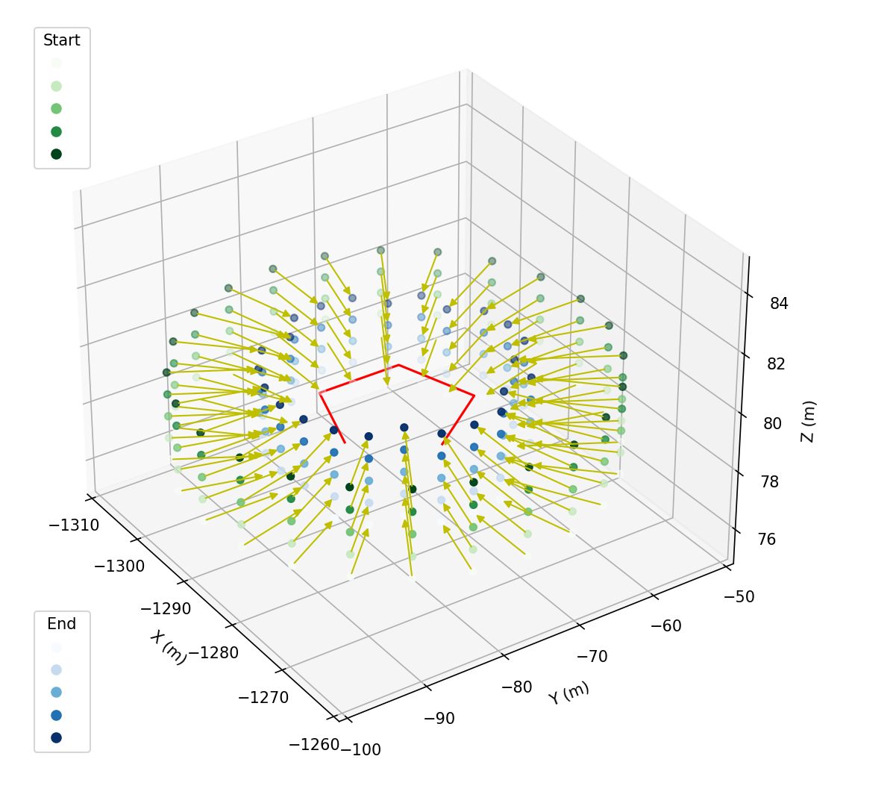

# Trajectory Generation

This documents serves to provide a detailed overview of the trajectory generation pieces available as part of the data collection module. During the data generation run, the drone moves along the `WayPoint` objects defined during trajectory generation which makes this step crucial in terms of the quantity, quality and variety of data generated through the module. 

At present, we support the following kinds of trajectories:

* [Takeoff-Landing](#takeoff-landing) 
* [Port-2-Port](#port2port)
* [Conic](#conic)
* [Cylindrical](#cylindrical)

These trajectories can either be defined through the [`config`](./config.md#collection-spec) or through [`API's`](./api.md#pre-trajectory-generation-apis)

### Takeoff-Landing

Imagine a circular plane in x-y around the specified `geo-location`. Trajectories of this pattern move the drone vertically up from points on this circular plane. At each height, the drone rotates through `n` yaw positions as defined through the config. In the diagram below, the blue circle is the circular plane. This pattern can be used to collect data above an object of interest. E.g. Get images of a landing pad below the sim agent from varying angles/heights

<!--  -->

The following parameters define the trajectory:
* `trajectory-len`: Desired number of waypoints
* `altitude-change`: delta between starting and max altitude in `m` 
* `radius`: Radius of the circular plane in `m`

An example of this trajectory being defined in the config can be found [here](../../client\python\example_user_scripts\datacollection\configs\datacollector_config.jsonc#L123)

Programmatically, this trajectory can be defined as:
```python
from projectairsim.datacollection.trajectory.takeoff_landing_trajectory import TakeoffLandingTrajectory

takeoff_landing = TakeoffLandingTrajectory(trajectory_len=300, altitude_change=20, radius=5)
```

### Conic

For this pattern, the drone moves up vertically in a conic path w.r.t the `geo-location`. The shape on the cone is defined through its params. This pattern can be used to collect data above an object of interest. E.g. Get images of a landing pad below the sim agent from varying angles/heights

<!--  -->

The following parameters define the trajectory:
* `trajectory-len`: Desired number of waypoints
* `altitude-change`: delta between starting and max altitude in `m` 
* `FOV`: Field Of View w.r.t to the `geo-location` in `deg`. Defines the shape of the cone

An example of this trajectory being defined in the config can be found [here](../../client\python\example_user_scripts\datacollection\configs\datacollector_config.jsonc#L128)

Programmatically, this trajectory can be defined as:
```python
from projectairsim.datacollection.trajectory.conical_trajectory import ConicalTrajectory

conic = ConicalTrajectory(trajectory_len=450, altitude_change=40, field_of_view=45)
```

### Port2Port

This pattern allows the user to generate trajectories between two points in space. This pattern allows for the generation of either random trajectories between those points or a planned one. This pattern can be used to collect data around an area of interest. E.g. Get images from different positions between Downtown and Cap Hill in Seattle

The random trajectories are generated through an implementation of the RRT planning algorithm with `euclidean-distance-to-goal` being hte only heuristic for progression through space. Given the random nature, we allow users to specify `n` number of these to be generated for a given pair of points

The planned trajectory is generated through the A* planning algorithm with the heuristic again being `euclidean-distance-to-goal`. Since we are aiming for a planned path, optimality is looked for when progressing through space. Given the planned nature of this trajectory, only `one` of these can be generated between a pair of points

<!--  -->

The following parameters define the trajectory:
* `trajectory-len`: Desired number of waypoints
* `trajectory-type`: Enum["random", "optimal"]
* `num-trajectories`: [Only applicable if `type` is `random`] Number of `random` trajectories to be generated
* `start-geo`: [lat, lon, alt] for start location
* `end-geo`: [lat, lon, alt] for goal location

An example of this trajectory being defined in the config can be found [here](../../client\python\example_user_scripts\datacollection\configs\datacollector_config.jsonc#L135)

Programmatically, this trajectory can be defined as:
```python
from projectairsim.datacollection.trajectory.port2port_trajectory import Port2PortTrajectory
from projectairsim.datacollection.types import GeoCoordinates

port2port = port2port = Port2PortTrajectory(
    config_dir="path/to/config",
    trajectory_len=1000,
    trajectory_type="optimal",
    start_geo=list(GeoCoordinates(33.047, -97.2919, 250)),
    end_geo=list(GeoCoordinates(34.589, -96.235, 50)),
)
```


### Cylindrical
This pattern allows the user to move the sim agent along the surface of a hypothetical cylinder in space. Port-2-port `optimal` trajectories are generated from the points on the outer surface to corresponding points on the inner surface. The cylinder is centered around the `geo-location` this trajectory is assigned to. This pattern can be used to collect data around an object of interest. E.g. Get images from all angles of an AirTaxi in the scene

<!--  -->

The following parameters define the trajectory :
* `trajectory-len`: Desired number of waypoints
* `altitude-change`: Change in altitude +/- the initial altitude in `m` 
* `outer-radius`: Outer radius of the hypothetical cylinder in `m`
* `inner-radius`: Inner radius of the hypothetical cylinder in `m`
* `angular-variations`: Number of points along each circular face from which port-2-port trajectories are generated (`int`)

An example of this trajectory being defined in the config can be found [here](../../client\python\example_user_scripts\datacollection\configs\datacollector_config.jsonc#L114)

Programmatically, this trajectory can be defined as:
```python
from projectairsim.datacollection.trajectory.cylindrical_trajectory import CylindricalTrajectory

cylindrical = CylindricalTrajectory(
        trajectory_len=250,
        altitude_change=5,
        outer_radius=20,
        inner_radius=10,
        angular_variation=6,
    )
```

### Note:
* The output trajectory length can be off by about +5% (always on the positive side)
* This error is due to the trajectory script estimating every other factor than the shape of the trajectory itself (shape is determined by the config params)
* Despite the estimation, the process is fully deterministic - you will generate the same trajectory for the same input params
* Each trajectory generation scripts outputs a modified [datacollection.types.GeoLocation](../../client\python\projectairsim\src\projectairsim\datacollection\types.py#L198) object. Here, the script adds a list of [datacollection.types.Waypoint](../../client\python\projectairsim\src\projectairsim\datacollection\types.py#L150) objects to the `trajectory` param of the `geo-location`. So, if you want to add your own trajectory gen script, make sure its output is in the correct format