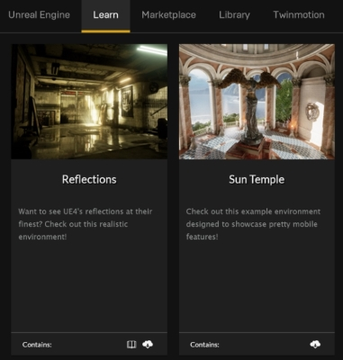

# Using Project AirSim Plugin in Custom Environments

The Project AirSim UE Plugin can be easily dropped into your own custom Unreal environment to enable simulation without requiring any code changes to your project.

## Project AirSim UE Plugin Package contents

The Project AirSim UE Plugin package contains the following contents:

```
ProjectAirSim_UE_Plugin_{Win64|Linux64}
  └─ Plugins
     └─ ProjectAirSim
     |  └─ Content
     |  └─ Resources
     |  └─ SimLibs
     |  └─ Source
     |    ProjectAirSim.uplugin
     └─ Drone
     |  └─ Content
     |  └─ Resources
     |    Drone.uplugin
     └─ <Any additional content-only plugins>
       ...
```

The package contains the `Plugins` folder that contains the `ProjectAirSim` UE plugin and additional content-only UE plugins, such as the `Drone` plugin that contains some basic drone mesh assets.

## How to add the Project AirSim Plugin to a custom Unreal environment

Adding the Project AirSim Plugin has just 3 basic steps:

1. Copy the Project AirSim Plugin package's `Plugins` folder into your UE environment project's root directory (the folder containing the main `.uproject` file). If your environment already has other plugins in the project's `Plugins` folder, you can just add the `ProjectAirSim` and additional content-only plugin folders into it.

2. Set the environment's `GameMode` to `ProjectAirSimGameMode`. There are two places that this should be set:

    A) in the environment's `Config/DefaultEngine.ini` config file (sets `GlobalDefaultGameMode` base mode for all maps in the environment).

    ```
    [/Script/EngineSettings.GameMapsSettings]
    GlobalDefaultGameMode=/Script/ProjectAirSim.ProjectAirSimGameMode
    ```

    B) in the Editor's `World Settings` tab for every game map of the environment (overrides the `DefaultEngine.ini` setting for each specific map). If the `World Settings` tab is not visible, it can be selected from the `Settings` button in the main Editor toolbar.

    

    To ensure that `ProjectAirSimGameMode` is activated properly, it's recommended to set the `GameMode` to `ProjectAirSimGameMode` in both of these places. For more info about this setting, see Unreal's **[Game Mode and Game State](https://docs.unrealengine.com/en-US/Gameplay/Framework/GameMode/index.html)**.

3. If the environment doesn't already have a `Source` folder in the root of the project, the project will not be able to build the Project AirSim plugin while packaging into a stand-alone game. You can trigger the generation of the necessary C++ boiler-plate code by adding a dummy C++ class by going to the Editor's `File` menu -> `New C++ Class...`. You can accept the `None` empty class with all defaults, and then after Unreal generates the `MyClass` base files and project C++ boiler-plate code, you can delete the dummy `MyClass.cpp` and `MyClass.hpp` that were just created.

That's it! When you start the game, the Project AirSim sim server should be ready for a client script to connect and load a scene.

### Example walkthrough using Unreal's SunTemple free learning environment

The following is an example of the steps for adding the Project AirSim Plugin to an existing Unreal Editor project.  For illustrative purposes only, this example uses the SunTemple free environment that can be obtained from the Epic Launcher's `Learn` tab in the `Engine Feature Samples` section.

  

  

1. Copy the Project AirSim `Plugins` folder into the SunTemple project's root folder.

2. With a text editor, edit the `Config/DefaultEngine.ini` file and change the line:

    `GlobalDefaultGameMode=/Script/Engine.GameMode`

    to

    `GlobalDefaultGameMode=/Script/ProjectAirSim.ProjectAirSimGameMode`

3. Double-click or open from the Unreal Editor the file `SunTemple.uproject`. As the project file is loaded, the Project AirSim Plugin should be detected and Unreal Editor will prompt to rebuild. Click **Yes**.  If the rebuild is successful, Unreal Editor should load the environment.

4. Set the environment's `GameMode` to `ProjectAirSimGameMode` as described in **[step 2 of How to add the Project AirSim Plugin](#how-to-add-the-projectairsim-plugin-to-a-custom-unreal-environment)**.

5. Since SunTemple doesn't come with an existing root `Source` folder for C++ source files, add a dummy C++ class to generate the boilerplate files as described in **[step 3 of How to add the Project AirSim Plugin](#how-to-add-the-projectairsim-plugin-to-a-custom-unreal-environment)**.

6. In the SunTemple environment, spawning at (x=0, y=0) would put the drone on top of a statue.  Move the drone's spawning point a bit to the left so it will land on the floor by opening the scene config file for the client script you want to run (e.g., `sim_config/scene_basic_drone.jsonc`) and modifying the drone origin's Y-value to -4.0 meters.

``` json
"actors": [
  {
    "type": "robot",
    "name": "Drone1",
    "origin": {
      "xyz": "0.0 -4.0 -10.0",
      "rpy-deg": "0 0 0"
    },
    "ref": "robot_quadrotor_fastphysics.jsonc"
  }
],
```

When you press `Play`, the drone should spawn and you're ready to fly!


## Forcing the Project AirSim and Drone Plugin content to be cooked when packaging the environment as a stand-alone game binary

The Project AirSim Plugin includes a content-only `Drone` plugin with the drone mesh assets that are used at runtime to spawn the drone. During play in the Editor, this content is accessible, but since the content is not directly referenced in the environment's code, it may not get **[cooked](https://docs.unrealengine.com/en-US/Engine/Deployment/Cooking/index.html)** during binary packaging of the environement.

To ensure the `Drone`, `Rover` and `Project AirSim` Plugin content is always cooked during environment packaging to a stand-alone game binary, you can add the following modifications to your environment's `Config/DefaultGame.ini` file:

To force Project AirSim plugin content (e.g., Drone assets) to get cooked:
```
[/Script/UnrealEd.ProjectPackagingSettings]
+DirectoriesToAlwaysCook=(Path="/ProjectAirSim")
+DirectoriesToAlwaysCook=(Path="/Drone")
+DirectoriesToAlwaysCook=(Path="/Rover")
```

or to force **all** content in the environment to always get cooked:

```
[/Script/UnrealEd.ProjectPackagingSettings]
bCookAll=True
```

## How to add multiple drones

You can also add more drones to the scene. See **[Multiple Robots in a Simulation](multiple_robots.md)** for more details.

## How to modify the drone

See **[How to Modify a Drone's Physical Geometry](modify_drone_physical.md)** for more details about how a drone's physical geometry can be modified through the **[Robot Configuration Settings](config_robot.md)**.

See **[How to Modify a Drone's Visual Appearance](modify_drone_visual.md)** for more details about how to customize a drone's visual appearance.

---

Copyright (C) Microsoft Corporation.  All rights reserved.
